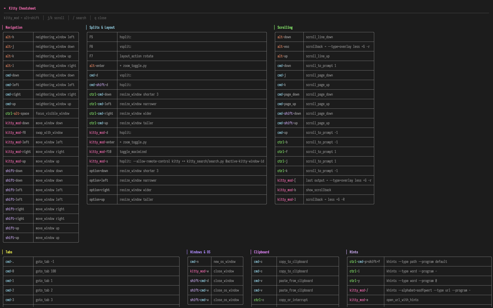
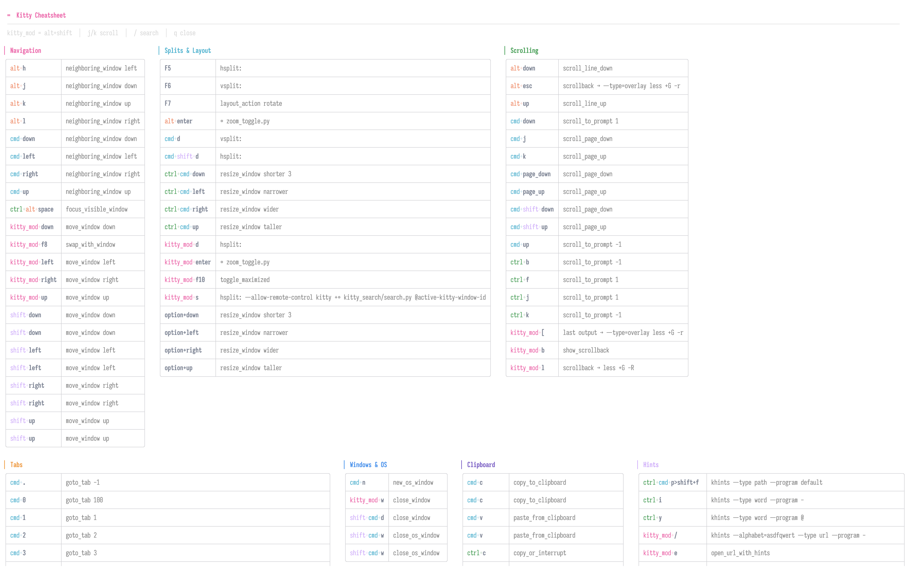

# kitty-cheatsheet

Interactive keybinding and mouse binding cheatsheet for the [kitty](https://sw.kovidgoyal.net/kitty/) terminal emulator.

Parses your kitty config files directly and renders a colorized, searchable, side-by-side cheatsheet in your terminal.

<table>
<tr>
<td><strong>Dark</strong></td>
<td><strong>Light</strong></td>
</tr>
<tr>
<td></td>
<td></td>
</tr>
</table>

## Quick Start

```bash
# if you still haven't installed uv:
# curl -LsSf https://astral.sh/uv/install.sh | sh
uvx kitty-cheatsheet
```

## Install

```bash
uv pip install kitty-cheatsheet
```

## Usage

```bash
# Launch the interactive TUI
kitty-cheatsheet

# Point at a custom config directory
kitty-cheatsheet --config-dir ~/.config/kitty

# Plain text output (also auto-detected when piped)
kitty-cheatsheet --no-color
kitty-cheatsheet | grep scroll
```

### From kitty

Add a keybinding to launch the cheatsheet as an overlay:

```conf
map kitty_mod+m launch --type=overlay kitty-cheatsheet
```

### TUI Controls

| Key | Action |
|-----|--------|
| `j` / `k` | Scroll up/down |
| `d` / `u` | Half-page down/up |
| `g` / `G` | Jump to top/bottom |
| `/` | Search (live filtering) |
| `Escape` | Clear search / quit |
| `q` | Quit |

## Configuration

Optional config file at `~/.config/kitty-cheatsheet/config.toml`:

```toml
config_dir = "~/.config/kitty"

[colors.modifiers]
kitty_mod = "#FF69B4"
cmd = "#00CED1"

[prettify]
"kitten ~/.config/kitty/" = "⚙ "
```

## License

MIT
